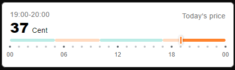
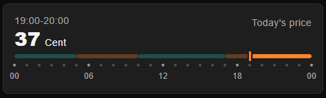
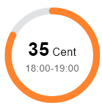
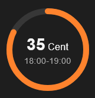
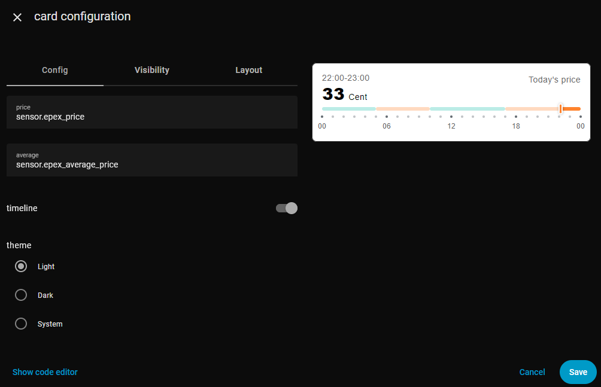

[![hacs][hacs-default]][hacs-default-link] [![hacs][hacs-validate]][hacs-validate-link]

# HA Price Timeline Card

A custom Home Assistant Lovelace card that visualizes **hourly energy prices** on a timeline or circle.  
Prices are color-coded in relation to the daily average, so you can quickly spot cheap and expensive hours.  
Supports multiple languages and two different modes and dark&light theme or default theme colors of your current theme:

### Timeline mode:
By default, the card shows a **timeline view** of today's electricity prices.  
Each bar represents one hour of the day, colored **turquoise** if the price is below the daily average and **orange** if above. Faded  
The current hour is highlighted with a marker, while **past hours** are shown faded to provide a quick visual distinction between past and upcoming prices.
A scale below the timeline shows the hours of the day.
- light
  
 

- dark

 
  
### Circle mode:
If `timeline: false` is set, the card switches to a **circle view**.  
The colored ring shows the current price in relation to the minimum and maximum of the day.  
Inside the circle, the current price (in Cent/kWh) and its time range are displayed.

- light

 

- dark
  
 


---

## 🚀 Features
Inspired by Tibber, this custom card visualizes **hourly energy prices** on a timeline or circle.

- 📊 Timeline view or circle of today's hourly electricity prices  
- 🎨 Color coding above/below daily average  
- ⏰ Current hour highlighted  
- 🌍 Multi-language support
- ⚡ Simple configuration  

---

## ⚙️ Installation

### Dependencies
This card is using data from the EPEX Spot add-on:

- [ha_epex_spot](https://github.com/mampfes/ha_epex_spot)  

You can choose between multiple sources:

- Awattar, SMARD.de, Tibber, ....

The price-timeline-card needs the average price and net price / price sensor.

### HACS
#### Community Store
The card is available in HACS (Home Assistant Community Store).

[](https://my.home-assistant.io/redirect/hacs_repository/?owner=Neisi&repository=ha-price-timeline-card)

#### Custom Repositories
1. Open HACS  
2. Frontend → top right menu → Custom Repositories → `Neisi/ha-price-timeline-card`  
3. Select type: Dashboard  
4. Install  

### Manual Installation (without HACS)
1. Copy `ha-price-timeline-card.js` to `/config/www/`  
2. Add it in Lovelace:  
```yaml
resources:
  - url: /local/ha-price-timeline-card.js
    type: module
```

### 🛠️ Parameters

Here are the available parameters for this Lovelace card.

### 🔒 Required Parameters

| Name       | Type   | Description |
|------------|--------|-------------|
| `price`   | string | Entity ID of the energy price sensor (must provide `attributes.data` with hourly prices). |
| `average` | string | Entity ID of the sensor that provides the daily average price. |

### Optional
| Name       | Type    | Default | Description |
|------------|---------|---------|-------------|
| `timeline` | boolean | `true`  | Show timeline view (`true`) or circle view (`false`). |
| `theme`    | string  | `light` | Visual theme. Possible values: `light`, `dark`, `theme` (uses Home Assistant theme variables). |

---

### 📘 Configuration

The card can be configured either with the code editor or with the visual editor.

#### Manual Configuration with Code Editor

timeline view and light theme (default):
```yaml
type: custom:price-timeline-card
price: sensor.epex_price
average: sensor.epex_average_price
```


circle view and dark theme:
```yaml
type: custom:price-timeline-card
price: sensor.epex_price
average: sensor.epex_average_price
theme: dark
timeline: false
```


#### Configuration with Visual Editor

The configuration can also be done using the built-in form editor (visual editor).



<!--BADGES-->
[hacs-default]: https://img.shields.io/badge/HACS-Default-blue?style=flat&logo=homeassistantcommunitystore&logoSize=auto
[hacs-default-link]: https://my.home-assistant.io/redirect/hacs_repository/?owner=Neisi&repository=ha-price-timeline-card&category=plugin
[hacs-validate]: https://github.com/ngocjohn/lunar-phase-card/actions/workflows/validate.yaml/badge.svg
[hacs-validate-link]: https://github.com/Neisi/ha-price-timeline-card/actions/workflows/validate.yaml
